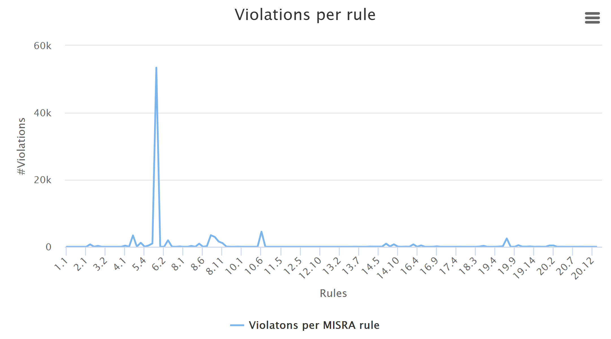

# misra
This project visualizes the misra violations of a code base. It is able to visualize the violations of the MISRA C2004 and MISRA C2012 standards. It parses the output of the tool <a href="https://scitools.com/">understand</a>.

# usage
1. Run the tool <a href="https://scitools.com/">understand</a> to analyse the codebase for misra violations.
1. Export the results from <a href="https://scitools.com/">understand</a> to a csv file.
1. Parse the csv file using the python script `parse-misra-c.py`with the following command: `python parse-misra-c.py --standard misraC2004 understand_codecheck_result.csv`.

This will generate the following set of files:

* misraC2004-violations-per-rule.csv
* misraC2004-violations-per-group.csv
* misraC2004-violations-per-file.csv
* misraC2004-violations-per-category.csv

# example output
